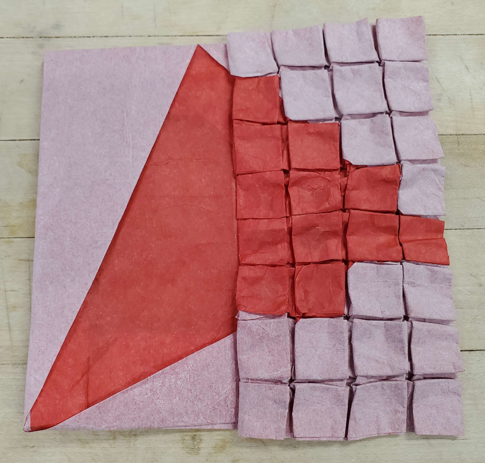
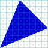
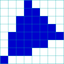
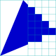

    <figure>
        
    </figure>
    <figure>
          
        <figcaption>Incompletely drawn to be less cluttered. Auxiliary (cyan) lines are just that, auxiliary. Where it says "折り込み", you fold some paper inside
        the pocket to reveal that nice 45° angle.</figcaption>
    </figure>

In computer graphics, *rasterization* is the process of taking a vector image (encoded with lines and curves) and turning it into a bitmap image (encoded with pixels). There are advanced ways to do this (involving anti-aliasing[^anti], multisampling[^multi], supersampling[^super], etc.), but a simple way to do it is to just color each pixel the color that's at its center.

    <figure>
        
        <figcaption>Before rasterization. White dots are pixel centers contained in the blue triangle.</figcaption>
    </figure>
    <figure>
        
        <figcaption>After rasterization.</figcaption>
    </figure>

So, I decided to show a before-and-after using origami. I wanted to make the rasterized side look like a pixel grid, so I needed to transition a big pleat on the left side into 7 small pleats on the right side. Which means it's time to brush up on those pleat transition construction skills.

    <figure>
          
        <figcaption>The warmup. This was before I realized I could just have one big pleat on the left side. Looks like a width-1 vertical pleat is far from
        enough to get this to work. Don't worry about folding it; it doesn't fold flat. And the vertical pleat flips! Bad!</figcaption>
    </figure>
    <figure>
          
        <figcaption>Attempt 2, with a wider vertical pleat. This actually folds flat. But then I realized I should have the entire transition happen to the left
        of that vertical mountain.</figcaption>
    </figure>
    <figure>
          
        <figcaption>Attempt 3, with a wider vertical pleat. The entire transition is completely hidden away now. But then I realized that the left side could just be
        one big pleat.</figcaption>
    </figure>
    <figure>
          
        <figcaption>Attempt 4, with one big pleat on the left. This is the transition I used in the final model.</figcaption>
    </figure>

With that out of the way here's the abstraction and the center of the crease pattern:

    <figure>
        
        <figcaption>The abstraction</figcaption>
    </figure>
    <figure>
          
        <figcaption>The crease pattern after the color change is folded in.</figcaption>
    </figure>

The goal is to:
* on the left side, avoid the auxiliary-outlined quadrilateral and cover everything outside the quadrilateral and inside the rectangle bordered by 3 mountains and an auxiliary line.
* on the right side, avoid every 4×4 square with a diamond inside it and cover every 4×4 square without a diamond.
* not have any same-color seams in the areas specified to avoid/cover.

That last requirement, in particular, is very tricky. But let's talk about the design of the various regions of the color change.[^pleat-twist]

### Bottom-left

    <figure>
          
        <figcaption>The bottom-left section</figcaption>
    </figure>

This side has the 45° angle at the bottom-left corner. To be able to construct the shape without same-color seams, I needed an extra pleat on the left
(of the central part of the crease patern) to be able to hide extra material in. I didn't draw the entire crease pattern for this section. Where it says "折り込み", there's more
paper hiding.

### Top-left

    <figure>
          
        <figcaption>The top-left section</figcaption>
    </figure>

There's a little dip on the right that needs to be covered. At first I tried to do this from the top side, but that resulted in the top-right section being difficult to make correct.
So instead it comes from the left, which required this pattern, which barely covers it, and is one of the reasons why the entire pattern is on a 108 grid.

### Top-right

    <figure>
          
        <figcaption>The top-right section</figcaption>
    </figure>

The beauty of this just being 45° stairs is that it can be covered correctly with a single fold, where the seam (barely) misses all the 4×4 squares. Nice.

### Bottom-right

    <figure>
          
        <figcaption>The bottom-right section</figcaption>
    </figure>

Unfortunately, the slope of 1/2 is trickier to cover while following the seam rules. I chose to cover it in 2 pieces. The bottom right corner covers most of the squares that need
to be coverted, but overshoots by 1 square. This part can thankfully be folded away at a 45° angle, with the seam missing all the 4×4 squares. The left column is properly covered
with a simple valley fold. Note the inside reverse fold. This creates a wrong-color seam, but this isn't a problem because it's in a place that would be covered.[^wcs]

## (Folding)

So, to actually fold it, I folded the color change part, then glued the layers together, then folded the central crease pattern.

[^anti]: the general term for any method that makes diagonal edges look less jagged when rasterized. Other than multisampling and supersampling, there's also the method typically used for SVGs where shapes are drawn one at a time and antialiased before they are drawn. Unfortunately, this causes seams to appear if two shapes just touch each other, to my great dismay. If two shapes have the same color (let's say red) and shape 1 covers 50% of a pixel and shape 2 covers exactly the other 50% of that pixel, you would expect the pixel to just be that color. However, in typical SVG drawing, shape 1 gets drawn first, and the pixel becomes 50% background 50% red. Then shape 2 gets drawn, and the pixel becomes 50% (50% background 50% red) 50% red, which is 25% background 75% red as opposed to the expected 0% background 100% red. (I have another little rant about SVGs but let's call it for now.)

[^multi]: like super-sampling, except that the fragment shader gets called only once per pixel, and then written to some sample positions depending on what parts of the pixel the triangle covers.

[^super]: the method where the image gets scaled up, then rasterized, then scaled down using something other than nearest neighbor interpolation. Unlike multisampling, the fragment shader gets called on each pixel of the scaled-up image.

[^pleat-twist]: You may notice that the pleats on the right side are MV-assigned weirdly. They're what I like to call *pleat twists*, and they make a nice lock. Slightly more detail can be found in the [orthogonal maze crane page](http://localhost:4000/origami/models/cranes/0020/).

[^wcs]: Technically, it happens to lie exactly on a line that doesn't get covered, but the seam can just be folded away, so whatever.