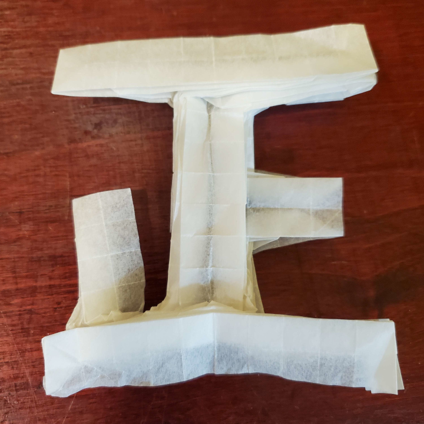
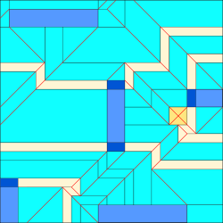

    <figure>
        
    </figure>
    <figure>
          
    </figure>

This is one of the first designs I made to test my knowledge of the edge-river method (ERM), an extension of disk-river packing for non-uniaxial designs
([explanation by Mu-Tsun Tsai](https://origami.abstreamace.com/2021/12/12/geography-of-origami-a-brief-introduction-to-the-edge-river-method/)).

    <figure>
        
        <figcaption>The abstraction for 正</figcaption>
    </figure>
    <figure>
        
        <figcaption>The ERM map. Same color scheme as in the linked explanation, except that super-light yellow is specifically peninsulas.</figcaption>
    </figure>

At the time, I couldn't figure out how to fill in peninsulas if they weren't touching the backside lakes (dark blue, areas hidden under normal lakes), and I didn't feel like
dealing with Pythagorean stretches, so there's room for optimization, but whatever.

As this was one of my first designs, it ended up being quite difficult to collapse, and I estimate spending 4 hours trying to attack it before it collapsed. Even then, the bottom-left vertical line could use some improvement.