

    <figure>
        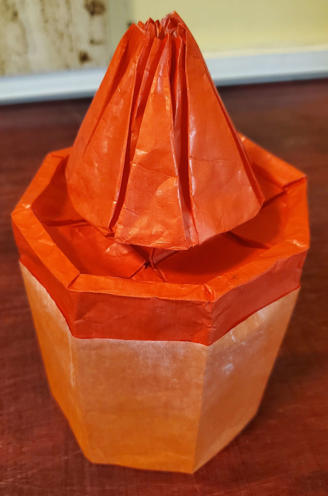
    </figure>
    <figure>
          
        <figcaption>(fold angles not assigned, color change not drawn. The pattern as shown is slightly non-square)</figcaption>
    </figure>

I made a 3D origami model inspired by the tower in Whomp's Fortress, Super Mario 64.

    <figure>
        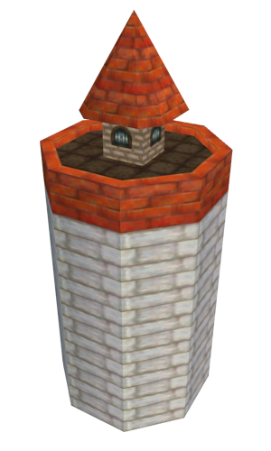
        <figcaption>The inspiration: the tower as it appears in Whomp's Fortress (this picture is from Super Maio 64 DS)</figcaption>
    </figure>
    <figure>
        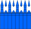
        <figcaption>The abstraction showing an approximate layout of the polygons. Slits are fake.</figcaption>
    </figure>

For this design I didn't use Origamizer because I'm not Tomohiro Tachi and I decided to manually lay it out and draw the crease pattern. I didn't really know ERM, however. All I
knew was "draw lines of reflection between an edge and the edge it's supposed to connect to and make one of those lines (at even parity) have the final fold angle (which could be 0°)".
How to transition these reflection lines was just trial and error. There were 3 major sections that I needed to testfold for to figure out the crease pattern.

## The Rim

    <figure>
          
        <figcaption>The rim.</figcaption>
    </figure>
    <figure>
        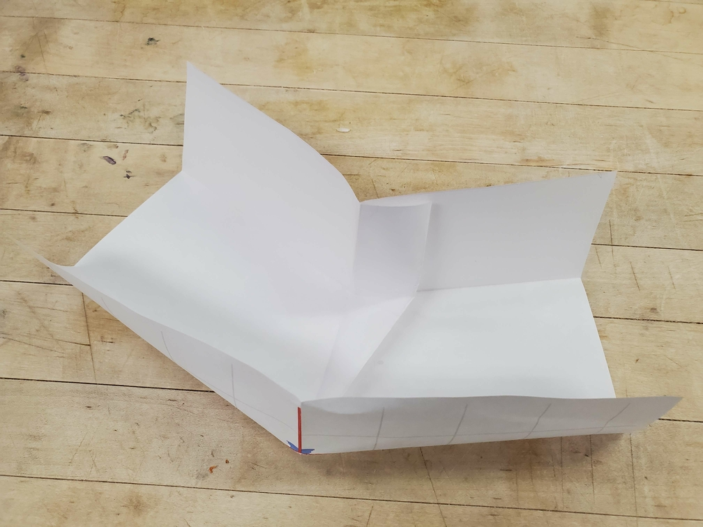
        <figcaption>The one test fold.</figcaption>
    </figure>

Each rim unit contains 5 vertices with a non-flat-foldable crease pattern, and probably some vertices that can fold flat but don't actually do so. And the angles up top are weird,
so I needed a test fold to figure out what in the world I'm even doing here (but thankfully only one, and then I figured out what I'm doing). I think I then used Blender to
make sure it was mathematically sound, but I don't have the file anymore. There's some [waffle walls](/2026/06/08/erm-01-introduction.html#waffle-walls) because of the concavity,
but they're hidden so it doesn't matter.

## The Window Wall

(well, I didn't do the windows.)

    <figure>
          
        <figcaption>The floor's inner side.</figcaption>
    </figure>
    <figure>
        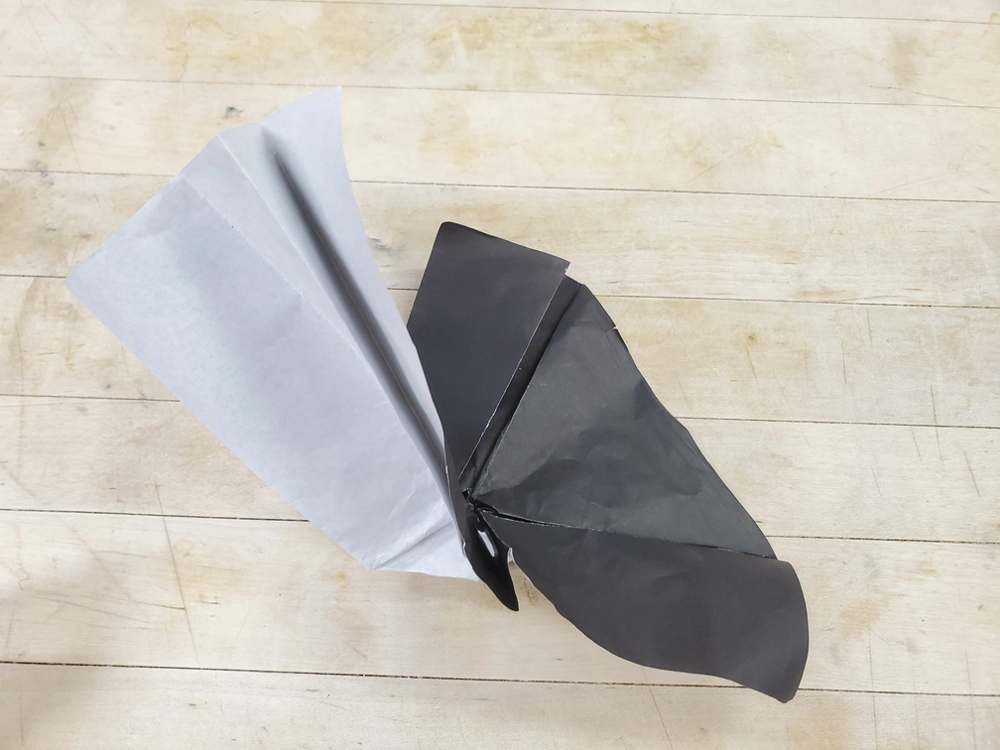
        <figcaption>Test fold #1. (failed to figure out structure)</figcaption>
    </figure>
    <figure>
        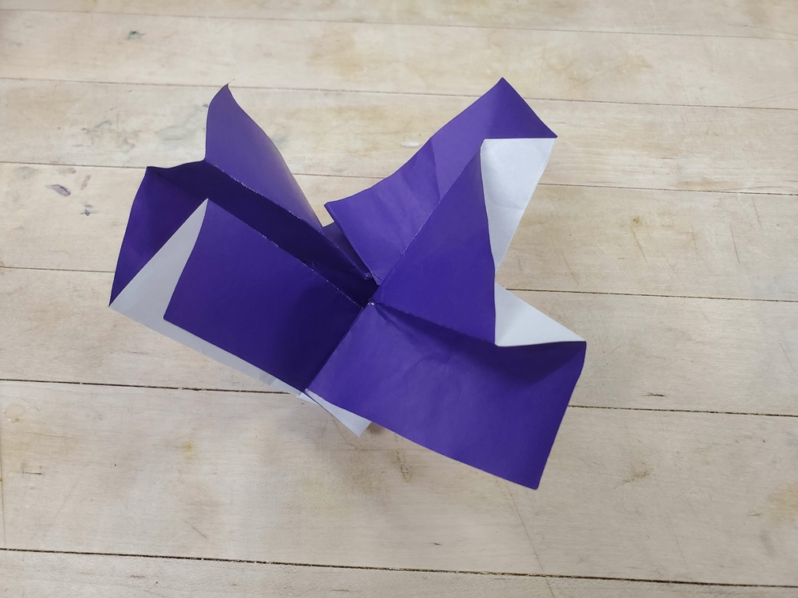
        <figcaption>Test fold #2. (success)</figcaption>
    </figure>

This part was harder than the last one, seeing as I needed 2 test folds to figure out the structure. Once I figured out the structure, I could argue without using Blender that
it's mathematically sound (up to self-intersection, but surely there's no self-intersction. I literally just folded it.):

    <figure>
        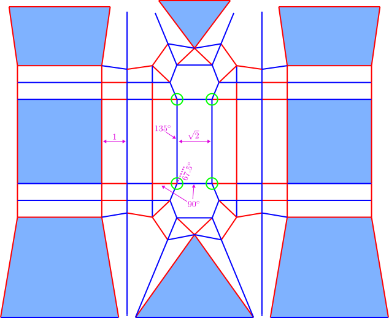
        <figcaption>The window wall, with some fold angles, face angles, and assumed lengths labelled</figcaption>
    </figure>

Assume that the usual pleat width between faces of the actual wall is 1. Then the width in the middle is $$\sqrt{2}$$. The three pleats in the middle form a right isosceles
triangular prism. Now, there are only 4 vertices that can't fold flat (the circled ones), and they're identical except for linear transformations. However, the structure
around each such vertex ensures that the faces go to their intended positions while keeping the vertex 360°[^3d-vertex]. Thus, this pattern works.

## The Roof Ridge

    <figure>
          
        <figcaption>The roof ridge.</figcaption>
    </figure>
    <figure>
        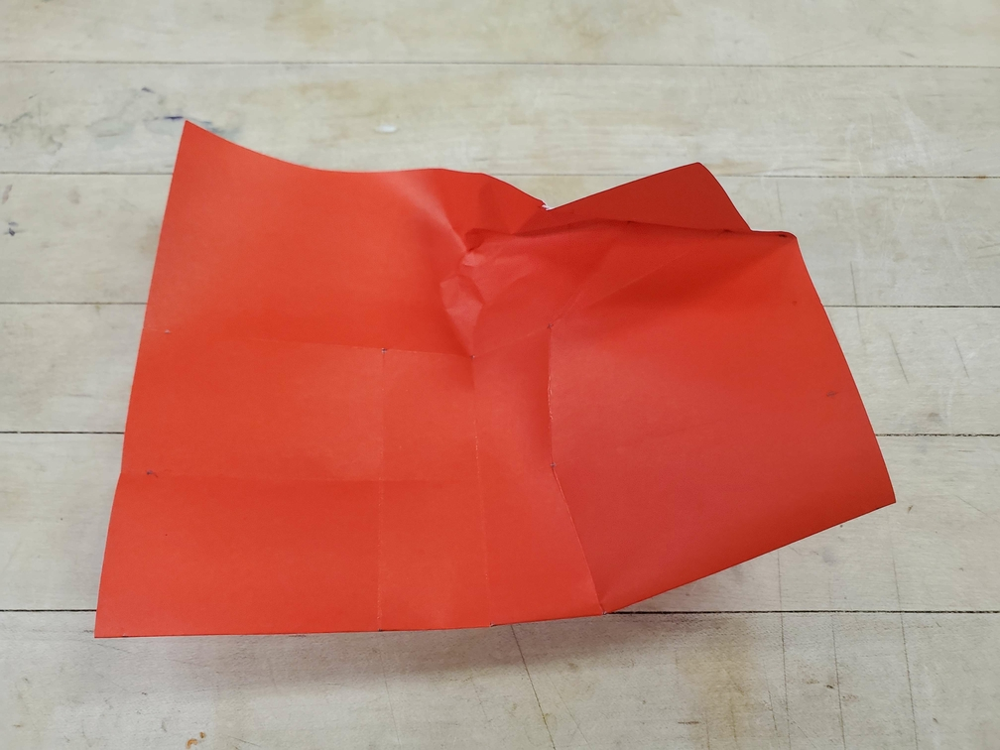
        <figcaption>Test fold #1. (failed to figure out structure)</figcaption>
    </figure>
    <figure>
        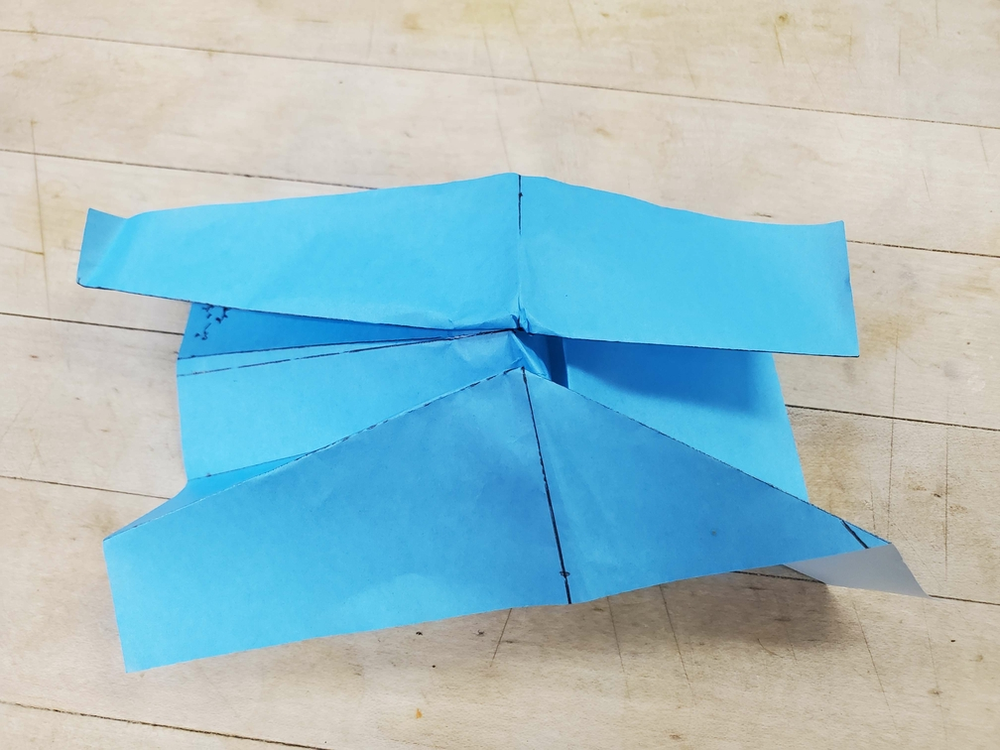
        <figcaption>Test fold #2. (failed to figure out structure)</figcaption>
    </figure>
    <figure>
        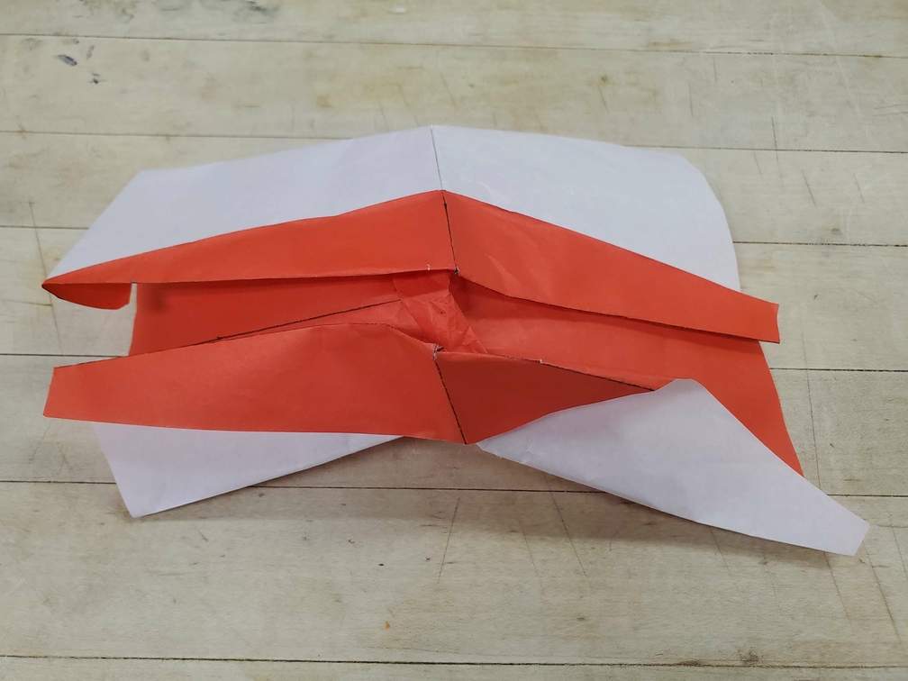
        <figcaption>Test fold #3. (success?)</figcaption>
    </figure>

Now for the hardest part, where I needed 3 test folds and don't remember if I actually figured out the structure from the third one, or just a hint. This one was
particularly hard, and I think I needed to think harder about which plane each face ends up on. The saving grace is that there isn't a concavity, so all faces can end up
on one of the 3 target planes and there are no waffle walls. This means that I could theoretically just have a single vertex that can't fold flat.
But the angles are all awkward, and I just had to play around with transitions until I got something that was somewhat simple. I will say that when actually
folding it, this pattern was partially mushed.

I could have made things easier by mapping the ridge to a single horizontal line instead of offsetting parts of it, but then I'd need to figure out another window wall structure.

## Putting it All Together

But then it was time to actually fold the tower. First, I test folded a fourth of it, to see how it would look.

    <figure>
        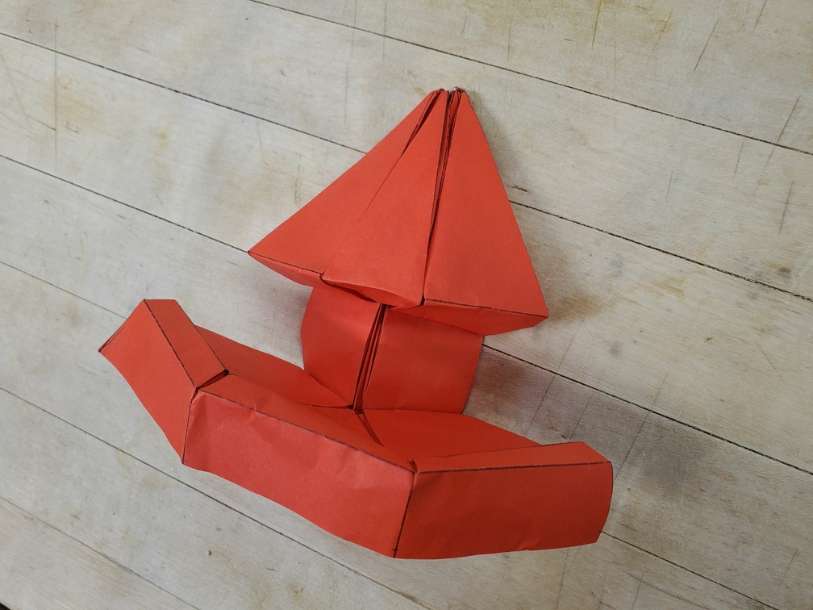
        <figcaption>Test folding a fourth of the tower. Looks good and locks well.</figcaption>
    </figure>

Then the entire tower was folded on a (I think) 16in×16in square of red-white-white triple bleeding tissue (I didn't have non-bleeding tissue at the time.) Since a lot of
awkward angles are present, I had to print out the crease pattern, put it under the paper, and trace over the creases with a bone folder. I made sure to leave room at the edges
so that I could bring one edge to the other and fold them together, hopefully locking the cylinder in place. Unfortunately, that didn't work out, since I had only the bottom side
to grab onto and it's pretty hard to actually fold the structure when you can reach it from only one side. And that's also why the top of the pyramid ended up subpar. That
structure is supposed to lock with some fold-ins, but those were hard to do because I could only reach the inside of the top of the tower from the bottom. Oh well.

A side note: while doing the test folding, I used a pen that wasn't working, and after a lot of creasing with that pen, it magically started working again[^working]. Oof.

[^3d-vertex]: In fact, this structure reminds me of a certain degree-4 3D vertex found in box pleating.
[^working]: I even wrote ふっかつしちゃった on one of the test folds to confirm it.